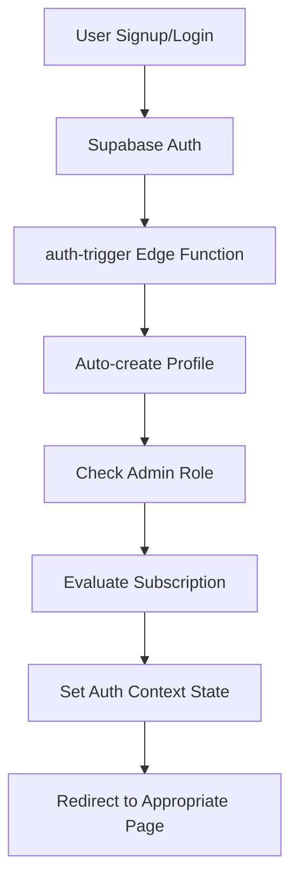
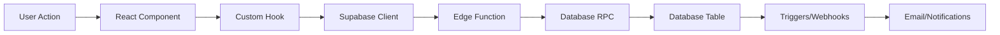
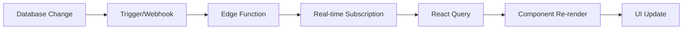

# Pull-Up Club Complete System Architecture
## Backend-to-Frontend Integration Map

This document showcases the complete overarching system architecture for the Pull-Up Club application, mapping all hooks, auth, types, utils, pages, components, and their backend connections.

---

## 🏗️ SYSTEM ARCHITECTURE OVERVIEW

```
┌─────────────────────────────────────────────────────────────────┐
│                         SUPABASE BACKEND                        │
├─────────────────────────────────────────────────────────────────┤
│ 🗄️  Database Schema (PostgreSQL)                               │
│ ⚡ Edge Functions (24 deployed)                                │
│ 🔐 Authentication (GoTrue)                                     │
│ 🔒 Row Level Security (RLS)                                    │
│ ⏰ CRON Jobs & Triggers                                        │
│ 📊 Materialized Views & Cache                                  │
└─────────────────────────────────────────────────────────────────┘
                                    ↕️
┌─────────────────────────────────────────────────────────────────┐
│                       REACT FRONTEND                           │
├─────────────────────────────────────────────────────────────────┤
│ 🎣 Custom Hooks                                                │
│ 🔐 Auth Context                                                │
│ 📊 Type Definitions                                            │
│ 🛠️  Utility Functions                                          │
│ 📄 Page Components                                             │
│ 🧩 UI Components                                               │
└─────────────────────────────────────────────────────────────────┘
```

---

## 🗄️ DATABASE LAYER

### **Core Tables & Schemas**
```sql
📊 SCHEMAS:
├── auth.*                  # Supabase Auth (users, sessions, mfa)
├── public.*               # Application data
├── cron.*                 # Scheduled jobs
├── storage.*              # File storage (not used - URL-based videos)
├── vault.*                # Encrypted secrets
└── supabase_functions.*   # Edge function metadata

🗃️ CORE TABLES:
├── profiles               # User profile data (links to auth.users)
├── submissions           # Video submissions with approval workflow
├── subscriptions         # Stripe subscription tracking
├── badges                # Achievement badge definitions
├── user_badges           # User badge assignments
├── admin_roles           # Role-based access control
├── leaderboard_cache     # Materialized view for performance
├── notification_queue    # Email notification system
├── email_events          # Email tracking and analytics
├── performance_logs      # System monitoring
└── processed_webhooks    # Idempotency tracking
```

### **Database Functions (RPCs)**
```sql
🔧 AUTH & ROLES:
├── handle_new_user()                    # Auto-create profile on signup
├── is_admin()                           # Check admin status
├── add_admin_role()                     # Grant admin privileges
└── delete_user()                        # Cascade user deletion

🏆 COMPETITION CORE:
├── get_leaderboard()                    # Retrieve ranked submissions
├── refresh_leaderboard()                # Update materialized view
├── user_can_submit()                    # Check submission eligibility
├── check_submission_eligibility()       # Detailed eligibility status
└── get_submission_status()              # User submission state

🏅 BADGE SYSTEM:
├── award_badges_on_approval()           # Auto-assign badges
├── refresh_badge_statistics()           # Update badge metrics
├── log_badge_assignment()               # Track badge events
└── get_badge_stats()                    # Badge analytics

💳 BILLING:
├── handle_pending_subscription()        # Store pre-auth subscription
├── clear_pending_subscription()         # Clear after payment
├── is_user_active_subscriber()          # Check subscription status
└── get_user_stats()                     # User analytics

📊 MONITORING:
├── log_performance()                    # System performance tracking
├── test_query_performance()             # Query optimization
└── system_metrics()                     # Health monitoring
```

---

## ⚡ EDGE FUNCTIONS LAYER

### **Auth & Onboarding**
```typescript
🔐 AUTH CLUSTER:
├── auth-trigger              # Profile creation on signup
├── welcome-flow              # Welcome email automation
└── summon-flow               # Monthly engagement emails

🎯 FUNCTIONALITY:
- Automatic profile creation
- Email template processing
- User onboarding automation
- CRON-based messaging
```

### **Billing & Payments**
```typescript
💳 BILLING CLUSTER:
├── stripe-webhooks           # Stripe event processing
├── create-checkout           # Checkout session creation
├── subscription-status       # Subscription state checking
├── customer-portal           # Billing management portal
├── billing-reminders         # Payment reminder automation
└── verify-stripe-session     # Session verification

🎯 FUNCTIONALITY:
- Secure payment processing
- Subscription lifecycle management
- Automated billing reminders
- Customer self-service portal
```

### **Content & Competition**
```typescript
🏆 COMPETITION CLUSTER:
├── video-upload              # Video URL validation
├── video-submission          # Submission processing
├── admin-submissions         # Admin review workflow
└── admin-leaderboard         # Leaderboard management

🎯 FUNCTIONALITY:
- Video URL validation (YouTube, TikTok, Instagram)
- Submission workflow automation
- Admin review interface
- Leaderboard cache management
```

### **Communication & Notifications**
```typescript
📧 EMAIL CLUSTER:
├── send-email                # Core email sending
├── resend-email              # Email service integration
└── resend-webhook            # Email event tracking

🎯 FUNCTIONALITY:
- Template-based email system
- Delivery tracking
- Engagement analytics
- Retry mechanisms
```

### **Admin & Operations**
```typescript
⚙️ ADMIN CLUSTER:
├── admin-get-users           # User management
├── admin-delete-user         # User deletion
├── check-auth-status         # Authentication verification
└── get_all_profiles          # Bulk profile operations

🎯 FUNCTIONALITY:
- User administration
- Bulk operations
- System health checks
- Administrative reporting
```

### **Monitoring & Operations**
```typescript
📊 MONITORING CLUSTER:
├── system-monitor            # System health monitoring
└── dependency-monitor        # Dependency tracking

🎯 FUNCTIONALITY:
- Performance metrics collection
- Dependency vulnerability scanning
- Automated alerting
- System optimization insights
```

---

## 🎣 CUSTOM HOOKS LAYER

### **Authentication Hooks**
```typescript
🔐 AUTH HOOKS:
├── useAuth()                 # Primary auth context consumer
└── useAdmin()                # Admin-specific functionality

🎯 CAPABILITIES:
- Session management
- Role-based access control
- Admin permission checking
- User state synchronization
```

### **Data Management Hooks**
```typescript
📊 DATA HOOKS:
├── useLeaderboard()          # Leaderboard data fetching
├── useOptimizedQuery()       # Cached query management
├── useSubmissions()          # User submission management
├── useVideoSubmission()      # Video submission workflow
└── useUserProfileWithCache() # Profile data with caching

🎯 CAPABILITIES:
- React Query integration
- Intelligent caching
- Real-time data synchronization
- Performance optimization
```

### **Analytics & Tracking Hooks**
```typescript
📈 ANALYTICS HOOKS:
├── useMetaTracking()         # Meta/Facebook pixel tracking
└── useOptimizedQuery()       # Performance analytics

🎯 CAPABILITIES:
- User behavior tracking
- Conversion analytics
- Performance monitoring
- A/B testing support
```

---

## 🔐 AUTHENTICATION SYSTEM

### **AuthContext Architecture**
```typescript
🔐 AUTH CONTEXT STATE:
├── user: User | null                    # Current authenticated user
├── profile: Profile | null              # User profile data
├── isAdmin: boolean                     # Admin role status
├── subscriptionState: string            # Subscription status
├── isLoading: boolean                   # Loading states
└── isFirstLogin: boolean                # Onboarding flow control

🎯 AUTH METHODS:
├── signIn(email, password)              # User authentication
├── signUp(email, password)              # User registration
├── signOut()                            # Session termination
├── resetPassword(email)                 # Password reset flow
├── processPendingSubscription()         # Post-auth subscription
├── fetchProfile(userId)                 # Profile data retrieval
└── evaluateSubscription()               # Subscription validation
```

### **Authentication Flow**


---

## 📊 TYPE DEFINITIONS

### **Core Interface Types**
```typescript
🏗️ CORE TYPES:
├── User                      # Authentication user data
├── Profile                   # Extended user profile
├── Submission                # Video submission data
├── LeaderboardEntry          # Ranked submission entry
├── Badge                     # Achievement badge definition
├── UserBadge                 # User badge assignment
├── Subscription              # Stripe subscription data
└── LeaderboardFilters        # Filtering criteria

🎯 UI TYPES:
├── LoadingState              # Loading component states
├── ErrorState                # Error handling types
├── ButtonVariant             # UI component variants
└── ModalProps                # Modal component interfaces

📊 API TYPES:
├── ApiResponse<T>            # Generic API response wrapper
├── EdgeFunctionResponse      # Edge function return types
├── WebhookEvent              # Stripe webhook event types
└── EmailEvent                # Email tracking event types
```

---

## 🛠️ UTILITY FUNCTIONS

### **Performance & Caching**
```typescript
⚡ PERFORMANCE UTILS:
├── cacheManager.ts           # Intelligent caching system
├── performanceMonitor.ts     # Performance tracking
└── queryOptimization.ts      # Database query optimization

🎯 CAPABILITIES:
- Multi-layer caching (memory, localStorage, query cache)
- Performance metrics collection
- Query optimization strategies
- Cache invalidation management
```

### **Analytics & Tracking**
```typescript
📈 ANALYTICS UTILS:
├── analytics.ts              # Google Analytics integration
├── metaTracking.ts           # Meta/Facebook pixel
└── performanceTracking.ts    # Performance analytics

🎯 CAPABILITIES:
- User behavior tracking
- Conversion funnel analysis
- Performance monitoring
- Custom event tracking
```

### **Data Processing**
```typescript
🔄 DATA UTILS:
├── videoUrlValidation.ts     # Video URL parsing/validation
├── badgeCalculation.ts       # Badge assignment logic
├── submissionFiltering.ts    # Leaderboard filtering
└── dateUtilities.ts          # Date/time processing

🎯 CAPABILITIES:
- Video platform URL validation
- Dynamic badge calculation
- Complex filtering logic
- Date/time manipulation
```

---

## 📄 PAGE COMPONENTS

### **Public Pages**
```typescript
🌍 PUBLIC PAGES:
├── Home/                     # Landing page with hero section
│   ├── Hero.tsx             # Main hero component
│   ├── Features.tsx         # Feature showcase
│   ├── LeaderboardPreview.tsx # Top 5 leaderboard preview
│   └── CallToAction.tsx     # Conversion elements
├── Leaderboard/              # Public leaderboard view
│   ├── LeaderboardPage.tsx  # Main leaderboard interface
│   ├── LeaderboardTable.tsx # Responsive table component
│   ├── LeaderboardFilters.tsx # Filtering interface
│   └── BadgeLegend.tsx      # Badge explanation
├── Rules/                    # Competition rules
├── FAQ/                      # Frequently asked questions
├── PrivacyPolicy/            # Privacy policy
└── CookiesPolicy/            # Cookie policy

🎯 FEATURES:
- SEO optimized
- Mobile responsive
- Performance optimized
- Accessible design
```

### **Authenticated Pages**
```typescript
🔒 AUTHENTICATED PAGES:
├── Profile/                  # User profile management
│   ├── ProfilePage.tsx      # Main profile interface
│   ├── ProfileForm.tsx      # Profile editing form
│   ├── SubscriptionCard.tsx # Subscription management
│   └── BadgeProgress.tsx    # Badge achievement progress
├── VideoSubmission/          # Video submission workflow
│   ├── VideoSubmissionPage.tsx # Submission form
│   ├── EligibilityCheck.tsx # Submission eligibility
│   ├── VideoValidation.tsx  # URL validation
│   └── SubmissionHistory.tsx # User submission history
├── Success/                  # Post-payment success page
└── Login/                    # Authentication interface

🎯 FEATURES:
- Form validation
- Real-time updates
- Progress tracking
- Error handling
```

### **Admin Pages**
```typescript
👑 ADMIN PAGES:
├── Admin/                    # Admin dashboard
│   ├── AdminDashboardPage.tsx # Main admin interface
│   ├── SubmissionReview.tsx # Video review workflow
│   ├── UserManagement.tsx   # User administration
│   ├── AdminPayoutsPage.tsx # Payout management
│   └── SystemMetrics.tsx    # System health monitoring

🎯 FEATURES:
- Role-based access control
- Bulk operations
- Analytics dashboards
- System monitoring
```

---

## 🧩 UI COMPONENT LIBRARY

### **Core UI Components**
```typescript
🎨 CORE COMPONENTS:
├── ui/
│   ├── Button.tsx           # Multi-variant button component
│   ├── Input.tsx            # Form input with validation
│   ├── Modal.tsx            # Accessible modal dialog
│   ├── Toast.tsx            # Notification system
│   ├── LoadingState.tsx     # Loading indicators
│   ├── ErrorState.tsx       # Error handling displays
│   ├── Badge.tsx            # Status badges
│   ├── Alert.tsx            # Alert messages
│   ├── Link.tsx             # Styled link component
│   └── Card.tsx             # Container cards

🎯 FEATURES:
- Consistent design system
- Accessibility compliant
- TypeScript fully typed
- Responsive design
```

### **Layout Components**
```typescript
🏗️ LAYOUT COMPONENTS:
├── Layout/
│   ├── Layout.tsx           # Main layout wrapper
│   ├── Header.tsx           # Site navigation
│   ├── Footer.tsx           # Site footer
│   ├── ProtectedRoute.tsx   # Auth route protection
│   ├── AdminRoute.tsx       # Admin route protection
│   ├── AnalyticsWrapper.tsx # Analytics integration
│   └── Head.tsx             # SEO head management

🎯 FEATURES:
- Responsive navigation
- Route protection
- SEO optimization
- Analytics integration
```

### **Feature-Specific Components**
```typescript
🎯 FEATURE COMPONENTS:
├── Leaderboard/
│   ├── LeaderboardTable.tsx # Responsive ranking table
│   ├── FilterBar.tsx        # Advanced filtering
│   └── PaginationControls.tsx # Navigation controls
├── Submission/
│   ├── VideoPlayer.tsx      # Embedded video player
│   ├── SubmissionCard.tsx   # Submission display
│   └── StatusBadge.tsx      # Submission status
├── Badge/
│   ├── BadgeDisplay.tsx     # Badge visualization
│   ├── ProgressBar.tsx      # Achievement progress
│   └── BadgeGrid.tsx        # Badge collection display
└── Admin/
    ├── DataTable.tsx        # Admin data tables
    ├── ActionButtons.tsx    # Bulk action controls
    └── MetricsCard.tsx      # Analytics displays
```

---

## 🔄 DATA FLOW ARCHITECTURE

### **Frontend → Backend Flow**


### **Backend → Frontend Flow**


---

## 🔒 SECURITY ARCHITECTURE

### **Row Level Security (RLS)**
```sql
🛡️ RLS POLICIES:
├── profiles                 # Users can only access their own profile
├── submissions             # Users can view own + approved submissions
├── subscriptions           # Users can only view their own subscription
├── user_badges             # Users can view own badges
├── admin_roles             # Admin-only access
└── notification_queue      # System-only access

🎯 SECURITY FEATURES:
- JWT-based authentication
- Role-based access control
- API-level security
- Input validation
- CSRF protection
```

### **API Security**
```typescript
🔐 API SECURITY:
├── JWT Authentication       # Supabase Auth tokens
├── RLS Policy Enforcement   # Database-level security
├── Input Validation         # Edge function validation
├── Rate Limiting           # API abuse prevention
├── CORS Configuration      # Cross-origin protection
└── Webhook Verification    # Stripe signature validation
```

---

## 📊 MONITORING & OBSERVABILITY

### **Performance Monitoring**
```typescript
📈 MONITORING STACK:
├── performance_logs         # Query performance tracking
├── edge_function_tests     # Edge function metrics
├── system_metrics          # Resource utilization
├── email_events            # Email delivery tracking
├── api_request_logs        # API performance
└── user_engagement         # User behavior analytics

🎯 CAPABILITIES:
- Real-time performance monitoring
- Automated alerting
- Performance optimization insights
- User behavior analytics
```

### **Error Tracking & Logging**
```typescript
🚨 ERROR HANDLING:
├── Frontend Error Boundaries # React error catching
├── Edge Function Error Logs  # Server-side error tracking
├── Database Function Logs    # RPC error tracking
├── Webhook Error Handling    # Stripe webhook failures
└── Email Delivery Failures   # Communication errors

🎯 CAPABILITIES:
- Comprehensive error tracking
- Automated error reporting
- Performance impact analysis
- User experience monitoring
```

---

## 🚀 DEPLOYMENT & SCALING

### **Infrastructure**
```yaml
🏗️ DEPLOYMENT ARCHITECTURE:
Frontend:
  - Vite Build System
  - Static Asset Optimization
  - CDN Distribution
  - Progressive Web App Features

Backend:
  - Supabase Cloud Platform
  - Auto-scaling Edge Functions
  - Global CDN
  - Automatic Backups

Database:
  - PostgreSQL on Supabase
  - Connection Pooling (Supavisor)
  - Read Replicas
  - Materialized Views

Monitoring:
  - Real-time Metrics
  - Automated Alerting
  - Performance Optimization
  - Capacity Planning
```

### **Scalability Features**
```typescript
⚡ SCALING CAPABILITIES:
├── Database Optimization    # Indexes, materialized views
├── Intelligent Caching      # Multi-layer cache strategy
├── Edge Function Auto-scale # Serverless scaling
├── CDN Asset Distribution   # Global content delivery
├── Connection Pooling       # Database connection optimization
└── Performance Monitoring   # Proactive optimization

🎯 TARGET CAPACITY:
- 100,000+ users
- 2,000 concurrent users
- Sub-second API responses
- 99.9% uptime
```

---

## 🎯 SYSTEM INTEGRATION SUMMARY

This Pull-Up Club system represents a comprehensive, production-ready application with:

- **24 Edge Functions** handling all server-side logic
- **15+ Custom Hooks** managing client-side state and data
- **50+ UI Components** providing consistent user experience
- **Comprehensive Type System** ensuring code reliability
- **Multi-layer Caching** optimizing performance
- **Real-time Monitoring** ensuring system health
- **Enterprise-grade Security** protecting user data
- **Scalable Architecture** supporting growth to 100K+ users

The system seamlessly integrates frontend React components with backend Supabase services, providing a modern, performant, and maintainable fitness competition platform.