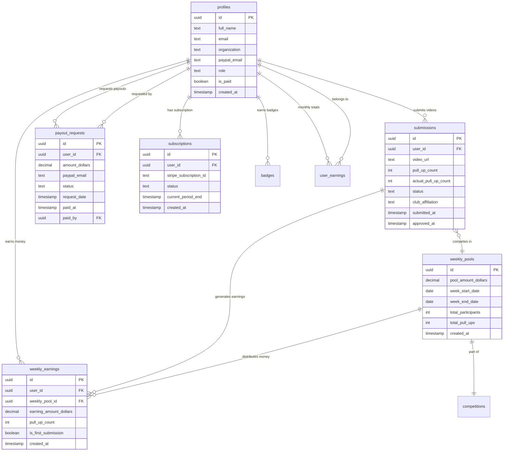

# Pull-Up Club System Guide
*Complete Technical & Business Overview*

## Table of Contents
1. [System Overview](#system-overview)
2. [Database Architecture](#database-architecture)
3. [User Experience Flows](#user-experience-flows)
4. [Payout System](#payout-system)
5. [Technical Implementation](#technical-implementation)
6. [Visual Diagrams](#visual-diagrams)

---

## System Overview

Pull-Up Club is a monthly pull-up competition platform where users submit video demonstrations of their pull-ups to compete for monetary prizes. The system is built on **Supabase** (PostgreSQL + Edge Functions) with **Stripe** for payments and **Next.js/React** for the frontend.

### Core Business Model
- **Subscription**: $9.99/month to participate
- **Competition**: Users submit pull-up videos weekly
- **Prizes**: $250 weekly prize pool distributed based on performance
- **Payouts**: Winners receive money via PayPal

### Key Statistics (Current State)
- **56 active profiles** with verified subscriptions
- **Weekly pools** of $250 distributed among participants
- **Competition system** with automated earnings calculation
- **Admin dashboard** for content moderation and payout management

---

## Database Architecture

### Core Tables Overview

The system consists of 25+ tables organized into logical groups:

#### **User Management**
- `profiles` - Complete user information and settings
- `admin_roles` - Admin privilege management
- `subscriptions` - Stripe subscription tracking

#### **Competition System**
- `submissions` - Video submissions with approval status
- `weekly_pools` - $250 weekly prize distribution
- `weekly_earnings` - Individual user earnings per week
- `user_earnings` - Monthly aggregated earnings

#### **Payout System**
- `payout_requests` - User requests for money withdrawal
- `pending_payments` - Stripe payments awaiting account linking

#### **Communication & Notifications**
- `email_notifications` - Outbound email queue
- `messages_log` - Communication history
- `notification_queue` - System notifications

#### **Achievements & Engagement**
- `badges` - Achievement definitions
- `user_badges` - User achievement records

### Detailed Table Schemas

#### Profiles Table (Central User Data)
```sql
profiles {
  id: UUID (PK, FK to auth.users)
  full_name: TEXT
  email: TEXT
  age: INTEGER
  gender: TEXT
  organization: TEXT (club affiliation)
  region: TEXT
  phone: TEXT
  stripe_customer_id: TEXT
  is_paid: BOOLEAN (subscription status)
  role: TEXT (user/admin)
  paypal_email: TEXT (for payouts)
  is_profile_completed: BOOLEAN
  created_at, updated_at: TIMESTAMP
  // ... 25+ more configuration fields
}
```

#### Submissions Table (Competition Entries)
```sql
submissions {
  id: UUID (PK)
  user_id: UUID (FK to profiles)
  video_url: TEXT
  pull_up_count: INTEGER (user claimed)
  actual_pull_up_count: INTEGER (admin verified)
  status: TEXT (pending, approved, rejected, featured)
  notes: TEXT (user notes)
  admin_notes: TEXT (admin feedback)
  submitted_at, approved_at: TIMESTAMP
  platform: TEXT (youtube, instagram, tiktok)
  // Additional submission metadata
}
```

#### Weekly Pools (Prize Distribution)
```sql
weekly_pools {
  id: UUID (PK)
  week_start_date, week_end_date: DATE
  total_amount_dollars: INTEGER (default 250)
  remaining_amount_dollars: INTEGER
  month_year: TEXT
  week_number_in_month: INTEGER
  created_at, updated_at: TIMESTAMP
}
```

#### Weekly Earnings (Individual Performance)
```sql
weekly_earnings {
  id: UUID (PK)
  user_id: UUID (FK to profiles)
  weekly_pool_id: UUID (FK to weekly_pools)
  submission_id: UUID (FK to submissions)
  pull_up_count: INTEGER
  earning_amount_dollars: INTEGER
  is_first_submission: BOOLEAN
  created_at, updated_at: TIMESTAMP
}
```

#### Payout Requests (Money Withdrawal)
```sql
payout_requests {
  id: UUID (PK)
  user_id: UUID (FK to profiles)
  amount_dollars: INTEGER
  status: TEXT (pending, approved, paid, rejected)
  paypal_email: TEXT
  payout_month: TEXT
  request_date: TIMESTAMP
  paid_at: TIMESTAMP
  paid_by: UUID (FK to auth.users - admin)
  notes: TEXT
}
```

---

## User Experience Flows

### 1. New User Onboarding Flow


**Key Business Rule**: Payment must occur BEFORE account creation. This ensures all users are paying customers.

### 2. Submission Process Flow


### 3. Payout Process Flow

```mermaid
graph TD
    A[User earns money] --> B[Money in weekly_earnings]
    B --> C[User requests payout]
    C --> D{Has PayPal email?}
    
    D -->|No| E[Must add PayPal first]
    E --> F[Update profile.paypal_email]
    F --> G[Create payout_requests record]
    
    D -->|Yes| G
    G --> H[Status: pending]
    H --> I[Admin reviews payout]
    I --> J{Admin decision}
    
    J -->|Approve| K[Admin sends PayPal payment]
    K --> L[Mark as paid in database]
    L --> M[Status: paid, paid_at: now()]
    
    J -->|Reject| N[Status: rejected]
    
    style K fill:#4caf50
    style N fill:#f44336
    style M fill:#2196f3
```

---

## Payout System

### How Users Earn Money

The earnings system is based on **weekly competition pools**:

1. **Weekly Pool**: Each week has a $250 prize pool
2. **Earnings Calculation**: Users earn $1 per verified pull-up
3. **First Submission Rule**: First submissions are recorded but may earn $0 (implementation varies)
4. **Pool Depletion**: Once $250 is distributed, no more earnings for that week

### Current Earnings Example (Real Data)
```
András Vass: 21 pull-ups = $21 earned (Week of 2025-07-28)
Evan Shortreed: 16 pull-ups = $16 earned 
Parker Gawne: 17 pull-ups = $17 earned
Ben Suter: 13 pull-ups = $13 earned
Marcos Tiderman: 18 pull-ups = $18 earned
```

### Payout Request Process

1. **Eligibility**: User must have earned money and added PayPal email
2. **Request**: User clicks "Request Payout" in their profile
3. **Admin Review**: Admins see all pending requests in Admin Dashboard
4. **Payment**: Admin manually sends PayPal payment
5. **Confirmation**: Admin marks payout as "paid" in system

### Admin Payout Management

The system provides admins with:
- **Monthly payout views** filtered by month
- **User PayPal email verification**
- **One-click payout status updates**
- **Payment tracking** with timestamps
- **Automated email reminders** for users missing PayPal setup

---

## Technical Implementation

### Backend Architecture (Supabase)

#### Edge Functions (Serverless API)
The system uses 25+ Supabase Edge Functions for:

**Core Operations:**
- `auth-trigger` - Auto-create user profiles on signup
- `stripe-webhooks` - Handle Stripe payment events
- `video-submission` - Process video submissions
- `request-payout` - Handle payout requests

**Admin Functions:**
- `admin-submissions` - Submission approval/rejection
- `admin-leaderboard` - Competition management
- `send-rejection-email` - Automated rejection notifications

**Communication:**
- `welcome-flow` - New subscriber onboarding
- `summon-flow` - Daily workout challenges
- `billing-reminders` - Subscription renewal notices

#### Database Functions
Key PostgreSQL functions include:

```sql
-- Automatically process earnings when submission approved
process_earnings_on_approval()

-- Calculate and distribute monthly payouts
generate_monthly_payouts(payout_month TEXT)

-- Get current competition status
get_pool_status()

-- Get user's monthly earning summary
get_user_monthly_earnings(user_id UUID, month TEXT)
```

#### Row Level Security (RLS)
All tables implement strict RLS policies:
- **Users** can only access their own data
- **Admins** have read/write access to all data
- **Public data** (leaderboards) available to all authenticated users

### Frontend Architecture (Next.js/React)

#### Key Pages & Components:
- **Home/Landing** - Public competition information
- **Leaderboard** - Public rankings (uses `user_best_submissions` view)
- **Profile/Dashboard** - User earnings, settings, payout requests
- **Admin Dashboard** - Submission reviews, payout management
- **Subscription Management** - Stripe integration

#### Authentication Flow:
Uses Supabase Auth with custom business logic:
- **Payment-first onboarding**
- **Profile completion requirements**  
- **Role-based access control**

---

## Visual Diagrams

### System Overview

### Database Relationship Diagram



### Submission to Earnings Flow

```mermaid
graph TB
    A[User Submits Video] --> B[Video Stored in Supabase Storage]
    B --> C[Submission Record Created]
    C --> D{Admin Reviews}
    D -->|Reject| E[Rejection Email Sent]
    E --> F[User Can Resubmit]
    F --> A
    D -->|Approve| G[process_earnings_on_approval Triggered]
    G --> H[Check Weekly Pool Exists]
    H -->|Create New| I[Create Weekly Pool with $250]
    H -->|Pool Exists| J[Use Existing Pool]
    I --> K[Calculate Earnings: $1 per Pull-up]
    J --> K
    K --> L[Create weekly_earnings Record]
    L --> M[Update weekly_pools Statistics]
    M --> N[Update user_earnings Monthly Total]
    N --> O[User Can Request Payout]
    
    subgraph "Database Updates"
        P[submissions.status = 'approved']
        Q[submissions.approved_at = NOW()]
        R[weekly_earnings.earning_amount_dollars]
        S[weekly_pools.total_participants++]
        T[weekly_pools.total_pull_ups++]
        U[user_earnings.monthly_total++]
    end
    
    G --> P
    P --> Q
    L --> R
    M --> S
    M --> T
    N --> U
```

### Payout Request Flow

```mermaid
graph TB
    A[User Views Profile Page] --> B{Has PayPal Email?}
    B -->|No| C[User Adds PayPal Email]
    C --> D[PayPal Saved to profiles.paypal_email]
    B -->|Yes| E{Has Available Earnings?}
    D --> E
    E -->|No| F[Show "No Earnings Yet"]
    E -->|Yes| G[Show Payout Button]
    G --> H[User Clicks Request Payout]
    H --> I[Calculate Available Amount]
    I --> J[Create payout_requests Record]
    J --> K[Status = 'pending']
    K --> L[Admin Reviews in Dashboard]
    L --> M{Admin Decision}
    M -->|Approve| N[Admin Sends PayPal Payment]
    N --> O[Admin Marks as 'paid']
    O --> P[payout_requests.paid_at = NOW()]
    P --> Q[User Receives Money]
    M -->|Reject| R[Status = 'rejected']
    R --> S[User Can Request Again]
    
    subgraph "Database Changes"
        T[payout_requests.amount_dollars]
        U[payout_requests.paypal_email]
        V[payout_requests.request_date]
        W[payout_requests.paid_by]
    end
    
    J --> T
    J --> U
    J --> V
    O --> W
```

### Admin Workflow Process


### Weekly Competition Cycle


---

*This comprehensive guide provides a complete technical and business overview of the Pull-Up Club system, covering all aspects from user onboarding to payout processing.*